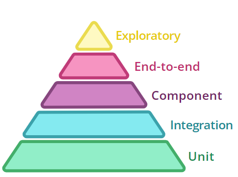
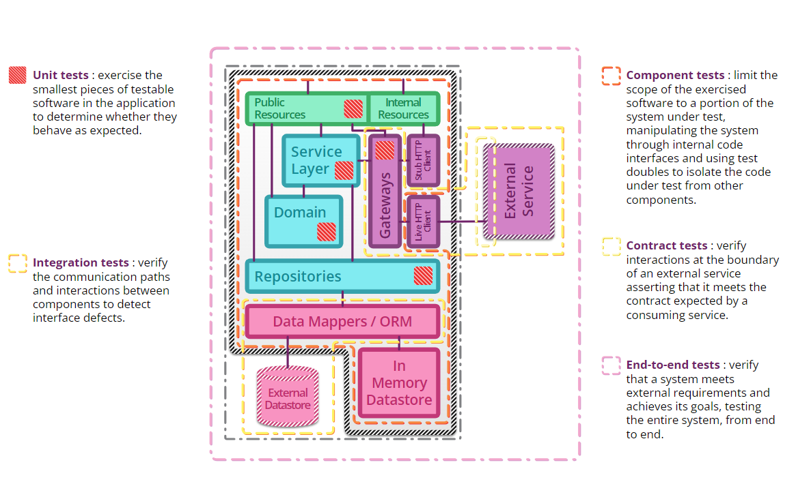

# Senior Software Engineer Challenge

Desafio Senior Software Engineer

## Resumo
* [Preparando o Ambiente](#setup_environment)
* [Desafio](#desafio)
    * [Pontos que daremos mais atenção](#pontos_atencao)
    * [Pontos que não iremos avaliar](#pontos_sem_avaliacao)
    * [Observações importantes](#observacoes)
* [Sobre a documentação](#about_docs)
    * [Como esperamos receber sua solução](#como_esperamos_receber)
* [Dicas](#dicas)

### <a name="setup_environment">Preparando o Ambiente</a>

Tecnologias necessárias para o desafio:

- JDK11 ou JDK17
- Docker
- Maven ou Gradle
- IntelliJ ou Eclipse (ou qualquer outra IDE de sua preferência)
- Postman ou Insomnia (ou qualquer outra ferramenta de sua preferência)

### <a name="desafio">Desafio</a>

A seguradora ACME precisa de uma API REST capaz de receber e consultar cotações de seguro e interagir com outros sistemas conforme o desenho abaixo:


O corpo da requisição a ser recebida deve seguir o seguinte formato:

```json
{
    "product_id": "c53d62bd-69de-4ec6-a90a-b6aa479ab571",
    "offer_id": "7b6eaa16-f559-462f-b610-3aaf9b81d527",
    "category": "PET",
    "total_monthly_premium_amount": 75.25,
    "total_coverage_amount": 10555.00,
    "coverages":[
        {
            "exams": 5000.45
        },
        {
            "vaccines": 750.25
        },
        {
            "daily_hospital_stay": 350.00
        }
    ],
    "assistances": [
        "medical appointments",
        "pet_store_discount"
    ],
    "customer": {
        "document_number": "36205578900",
        "name": "John Wick",
        "type": "NATURAL",
        "gender": "MALE",
        "date_of_birth": "1973-05-02",
        "email": "johnwick@gmail.com",
        "phone_number": 11950503030
    }
}
```

Ao receber a requisição é necessário verificar se a oferta e o produto informados são válidos, para isto é necessário consultar a API do serviço de Catálogo. 

Também é necessário se o **valor total do prêmio mensal** está entre o **máximo** e **mínimo** definido para a oferta e se o **valor total das coberturas** está correto, ou seja, se realmente é a soma das coberturas informadas.

Os demais campos como coberturas, assistências e dados do cliente são **livres**.

Para iniciar o serviço de Catálogo utilze o comando abaixo:

```shell script
 docker run -p 8080:8080 itausegdev/catalog-service:1716508943
```

Após isso você pode consultar a documentação da API de catálogo através do seguinte endpoint:

```shell script
 http://localhost:8080/swagger-ui
```
 **Observação:** As categorias, produtos e ofertas já estão cadastrados neste serviço, então não é necessário se preocupar em adicionar mais dados a esta API.


Caso a solicitação seja válida é necessário persistir a cotação em um banco de dados de sua preferência gerando um identificador único em formato UUID e publicar um evento via tópico kafka da cotação recebida.

Se a solicitação for inválida é necessário retornar um erro na chamada da API para que cliente corrija os dados e tente novamente.

Após publicar o evento da cotação recebida o serviço de apólices irá gerar a apólice e publicar um evento de apólice emitida em outro tópico kafka.

O serviço de cotação deverá então receber este evento (apólice emitida) e atualizar a cotação com o número da apólice gerada.

Abaixo os tópicos e avros necessários para esta integração:

| Tópico                              | Descrição                    | Avro                                                                                    |
|-------------------------------------|------------------------------|-----------------------------------------------------------------------------------------|
| itausegdev-insurance-quote-received | Tópico de cotações recebidas | [Clique Aqui](assets/avro/br.itausegdev.quotes.schemas.insurance_quote_received.avsc)   |  
| itausegdev-insurance-policy-emitted | Tópico de apólices emitidas  | [Clique Aqui](assets/avro/br.itausegdev.policies.schemas.insurance_policy_emitted.avsc) |  

Para iniciar o serviço de apólices utilize o comando abaixo: 

```shell script
 docker run -p 8084:8084 itausegdev/insurance-policy-service:1716495756
```

Adicionalmente você pode utilizar o seguinte arquivo `yml` para preparar o ambiente com o Apache Kafka:

```yaml
version: "3.8"

services:

  zookeeper:
    image: confluentinc/cp-zookeeper:5.4.0
    hostname: zookeeper
    container_name: zookeeper
    ports:
      - "2181:2181"
    environment:
      ZOOKEEPER_CLIENT_PORT: 2181
      ZOOKEEPER_TICK_TIME: 2000

  broker:
    image: confluentinc/cp-server:5.4.0
    hostname: broker
    container_name: broker
    depends_on:
      - zookeeper
    ports:
      - "9092:9092"
    environment:
      KAFKA_BROKER_ID: 1
      KAFKA_ZOOKEEPER_CONNECT: "zookeeper:2181"
      KAFKA_LISTENER_SECURITY_PROTOCOL_MAP: PLAINTEXT:PLAINTEXT,PLAINTEXT_HOST:PLAINTEXT
      KAFKA_ADVERTISED_LISTENERS: PLAINTEXT://broker:29092,PLAINTEXT_HOST://localhost:9092
      KAFKA_METRIC_REPORTERS: io.confluent.metrics.reporter.ConfluentMetricsReporter
      KAFKA_OFFSETS_TOPIC_REPLICATION_FACTOR: 1
      KAFKA_GROUP_INITIAL_REBALANCE_DELAY_MS: 0
      KAFKA_CONFLUENT_LICENSE_TOPIC_REPLICATION_FACTOR: 1
      CONFLUENT_METRICS_REPORTER_BOOTSTRAP_SERVERS: broker:29092
      CONFLUENT_METRICS_REPORTER_ZOOKEEPER_CONNECT: zookeeper:2181
      CONFLUENT_METRICS_REPORTER_TOPIC_REPLICAS: 1
      CONFLUENT_METRICS_ENABLE: "true"
      CONFLUENT_SUPPORT_CUSTOMER_ID: "anonymous"

  kafka-tools:
    image: confluentinc/cp-kafka:5.4.0
    hostname: kafka-tools
    container_name: kafka-tools
    command: ["tail", "-f", "/dev/null"]
    network_mode: "host"

  schema-registry:
    image: confluentinc/cp-schema-registry:5.4.0
    container_name: schema-registry
    depends_on:
      - zookeeper
      - broker
    ports:
      - "8081:8081"
    environment:
      SCHEMA_REGISTRY_HOST_NAME: localhost
      SCHEMA_REGISTRY_KAFKASTORE_CONNECTION_URL: "zookeeper:2181"

  control-center:
    image: confluentinc/cp-enterprise-control-center:5.4.0
    hostname: control-center
    container_name: control-center
    depends_on:
      - zookeeper
      - broker
      - schema-registry
    ports:
      - "9021:9021"
    environment:
      CONTROL_CENTER_BOOTSTRAP_SERVERS: 'broker:29092'
      CONTROL_CENTER_ZOOKEEPER_CONNECT: 'zookeeper:2181'
      CONTROL_CENTER_SCHEMA_REGISTRY_URL: "http://localhost:8081"
      CONTROL_CENTER_REPLICATION_FACTOR: 1
      CONTROL_CENTER_INTERNAL_TOPICS_PARTITIONS: 1
      CONTROL_CENTER_MONITORING_INTERCEPTOR_TOPIC_PARTITIONS: 1
      CONFLUENT_METRICS_TOPIC_REPLICATION: 1
      PORT: 9021
```      

**Observação**: Caso prefira você pode adicionar os serviços de catálogo e apólice neste arquivo para facilitar a gestão das imagens Docker. Não se preocupe com a criação dos tópicos, pois o serviço de apólices irá criá-los automaticamente durante o startup.

O endpoint de consulta da cotação de seguro deverá conter os seguintes campos:

```json
{
    "id": "2fc0e0f8-e1c7-4bfb-9f2d-2058f969910f",
    "product_id": "c53d62bd-69de-4ec6-a90a-b6aa479ab571",
    "offer_id": "7b6eaa16-f559-462f-b610-3aaf9b81d527",
    "insurance_policy_id": "43eaf9cf-9dbe-469c-85f9-022573009d1e",
    "category": "PET",
    "created_at": "2024-05-22T20:37:17.090098",
    "updated_at": "2024-05-22T21:05:02.090098",
    "total_monthly_premium_amount": 75.25,
    "total_coverage_amount": 10555.00,
    "coverages":[
        {
            "exams": 5000.45
        },
        {
            "vaccines": 750.25
        },
        {
            "daily_hospital_stay": 350.00
        }
    ],
    "assistances": [
        "medical appointments",
        "pet_store_discount"
    ],
    "customer": {
        "document_number": "36205578900",
        "name": "John Wick",
        "type": "NATURAL",
        "gender": "MALE",
        "date_of_birth": "1973-05-02",
        "email": "johnwick@gmail.com",
        "phone_number": 11950503030
    }
}
```

Abaixo deixamos um resumo de todos os requisitos para que você possa fazer um checklist antes de entregar o desafio:

| Requisito                                                                           | Observações                                                                         |
|-------------------------------------------------------------------------------------| ------------------------------------------------------------------------------------|
| - [ ] Desenvolvimento do endpoint para receber as cotações de seguro                | Caso prefira pode documentar a a API com OpenAPI                                    |
| - [ ] Validação do produto e oferta da requisião                                    | O serviço de catálogo já é dado no desafio em uma imagem Docker                     |
| - [ ] Persistência da cotação de seguro recebida                                    | O banco de dados pode ser de sua preferência, porém deve utilizar uma imagem Docker |
| - [ ] Envio da mensagem da cotação recebida no tópico kafka                         | Apache Kafka e serviço apólice já estão disponibilizados no desafio                 |
| - [ ] Recebimento da mensagem da apólice emitida no tópico kafka                    | Apache Kafka e serviço apólice já estão disponibilizados no desafio                 |
| - [ ] Atualização da cotação de seguro no banco de dados com os dados da apólice    | Apache Kafka e serviço apólice já estão disponibilizados no desafio                 |
| - [ ] Desenvolvimento do(s) endpoint(s) para consulta da(s) cotação(ões) de seguro  | Apache Kafka e serviço apólice já estão disponibilizados no desafio                 |

### <a name="pontos_atencao">Pontos que daremos mais atenção</a>
- Testes de unidade e integração
- Cobertura de testes (Code Coverage)
- Arquitetura utilizada
- Abstração, acoplamento, extensibilidade e coesão
- Profundidade na utilização de Design Patterns
- Clean Architecture
- Clean Code
- SOLID
- Documentação da Solução no README.md
- Observabilidade (métricas, traces e logs)

### <a name="pontos_sem_avaliacao">Pontos que não iremos avaliar</a>
- Dockerfile
- Scripts CI/CD
- Collections do Postman, Insomnia ou qualquer outra ferramenta para execução

## <a name="about_docs">Sobre a documentação</a>
Nesta etapa do processo seletivo queremos entender as decisões por trás do código, portanto é fundamental que o README.md tenha algumas informações referentes a sua solução.

Algumas dicas do que esperamos ver são:
- Instruções básicas de como executar o projeto
- Detalhes sobre a solução, gostaríamos de saber qual foi o seu racional nas decisões
- Caso algo não esteja claro e você precisou assumir alguma premissa, quais foram e o que te motivou a tomar essas decisões

### <a name="como_esperamos_receber">Como esperamos receber sua solução</a>
Esta etapa é eliminatória, e por isso esperamos que o código reflita essa importância.

Se tiver algum imprevisto, dúvida ou problema, por favor entre em contato com a gente, estamos aqui para ajudar.

Atualmente trabalhamos com a stack Java/Spring, porém você pode utilizar a tecnologia de sua preferência.

Para candidatos externos nos envie o link de um repositório público com a sua solução e para candidatos internos o projeto em formato .zip

### <a name="observacoes">Observações importantes</a>

Não é necessário parametrizar os impostos em arquivos de configuração ou persisti-los em base de dados.
Os campos a serem persistidos devem ser somente os informados no <a name="desafio">desafio</a>.

## <a name="dicas">Dicas</a>

Aqui vão algumas dicas que podem ser úteis.

### <a name="testes">Testes</a>
Como item opcional de leitura, deixamos este artigo rápido sobre testes [Testing Strategies in a Microservice Architecture](https://martinfowler.com/articles/microservice-testing/).

Nele é possível ver a diferença entre os principais tipos de teste.



Também há um exemplo para cada tipo de teste no artigo que pode ajudar no desafio.




